# Sheaf Theory for Image Reconstruction and Cortical-Layer Measurement

Sheaf Theory is a well known mathematical field that is used to compose many subject's local data
into a form of global structures. Cellular sheaf theory supplies that local-to-global consistency rule.  
Local image registration supplies the evidence; the sheaf solve combines compatible
evidence and exposes incompatible evidence as discord/no-call regions.

## What is a sheaf?

Think of LSFM data as a set of partially overlapping snapshots of the same
brain. Each snapshot can make a **local claim**: “this feature is here,” “my
offset from my neighbour is this,” or “this layer boundary is at this depth.”
The hard part is that all local claims must fit together into one 3D result.
If they do not, independently trusting every local match makes the error drift
through the reconstruction.

A **graph** tells us which images overlap: images/tiles/columns are *nodes* and
their overlaps are *edges*. A **sheaf** adds the missing meaning to that graph:
it specifies what each node stores and how to convert two neighbouring local
values into the same coordinate system before comparing them. In this project:

- A reconstruction node stores its unknown spatial correction $u_i$.
- A registration edge stores a locally measured relative shift $d_{ij}$ and
  confidence $w_{ij}$.
- A cortical-column node stores five proposed layer-boundary positions.
- A cortical-profile edge stores how depths in one column correspond to depths
  in its neighbour, including local stretching/compression.

It's important to realize that a sheaf is not merely “smoothing a graph.” Ordinary smoothing says adjacent
values should be equal. That would be wrong here: two overlapping tiles should
be separated by a measured displacement, and neighbouring cortical columns can
be locally warped relative to one another. Sheaf restriction maps encode those
physical relationships instead.

## The math behind sheaf


First, make an overlap map: every image tile, slice, or cortical column is a
**node**; an overlap between two of them is an **edge**. Each node makes a local
measurement $m_i$. For example, $m_i$ can be that tile’s estimated 3D position,
or the five cortical-layer boundary positions predicted in one column.

Before comparing two neighbouring nodes, our program uses a **restriction map**
$R_{i,e}$. It simply means: “convert node $i$’s local answer into the physical
coordinate system shared by this overlap $e$.” That conversion is what makes
this more than ordinary smoothing.

```math
\text{mismatch on overlap }e=(i,j)
=R_{j,e}s_j-R_{i,e}s_i.
```

If that mismatch is zero, the two local answers **glue together**. In sheaf
terminology, this edge-by-edge mismatch is the *coboundary*, and a complete set
of answers that all glue together is a *global section*. Essentially, the goal of
this is to answer the question: “can all of
the local measurements coexist in one coherent 3D result?”

The solver balances two common-sense goals:

```math
\hat s=\underset{s}{\mathrm{argmin}}
\underbrace{\sum_i\lVert s_i-m_i\rVert_{\Sigma_i^{-1}}^2}_{\text{stay close to what each image says}}
+\lambda\underbrace{\sum_{e}\lVert R_{j,e}s_j-R_{i,e}s_i\rVert_{W_e}^2}_{\text{make neighbouring answers agree in their shared space}}.
```

The first part trusts clear, confident images more than noisy ones; $\Sigma_i$
represents uncertainty. The second part penalizes disagreements between
overlaps; $W_e$ gives trustworthy overlaps more influence. $\lambda$ is one
knob that controls how strongly sheaf insists on global agreement. In more
formal language, this second term is the **sheaf-Laplacian penalty**. If every
$R$ were just the identity, it would collapse to ordinary graph smoothing.

The same equation is used in two places:

- **Coordinate sheaf:** $s_i$ is a 3D correction for one tile/slice. The
  overlap says how far apart the two images should be.
- **Laminar sheaf:** $s_i$ is a five-number vector,
  $(b_{I/II},b_{II/III},b_{III/IV},b_{IV/V},b_{V/VI})$. The restriction map
  accounts for the fact that two nearby cortical columns can have different
  local depth scales or slight geometric warping.

Finally, our program keeps the leftover mismatch instead of hiding it. A large
residual means an overlap cannot be made consistent with the rest of the data.
That becomes a **discord/no-call** flag: report uncertainty rather than force a
possibly wrong registration or layer boundary. By using our program,
we improve consistency and failure detection.

## Why this fits LSFM

Large light-sheet datasets are naturally local: tiles/slices overlap, signal
quality varies, clearing and registration can introduce distortions, and some
regions contain too little shared structure to register reliably. These are
exactly the conditions where redundant overlap cycles are useful. One weak
pairwise match is not allowed to determine the atlas by itself; it must agree
with the other paths through the overlap graph.

The same construction carries downstream to cortical layers. A local image
model can propose boundaries for one cortical column, but adjacent columns must
form a continuous physical laminar field after the restriction maps account for
local profile geometry.

## An example of sheaf theory

The clearest concrete example is the public BigStitcher 3D microscopy example
[2]. It contains six raw, overlapping 512 × 512 × 86 confocal image tiles.
Here, each physical tile is one graph vertex. The blue line between two tiles is
one measured image overlap: it stores a relative shift and a match confidence.
The 11 blue lines are the 11 overlap measurements used by the solver.

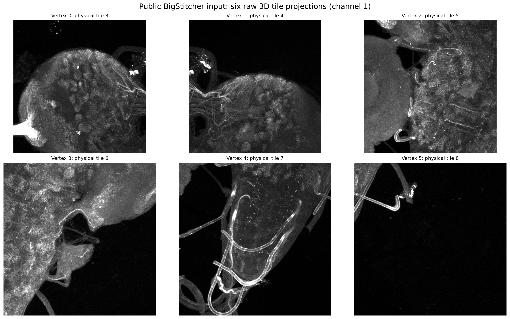

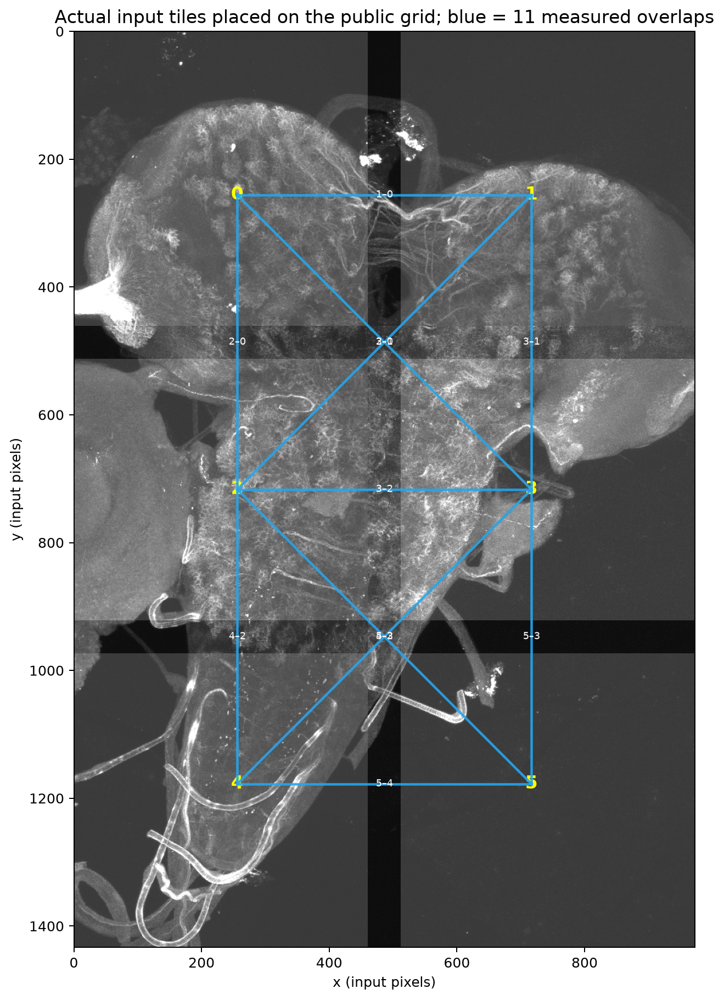

For example, the edge from tile 5 to tile 3 stores a local registration
$d_{53}$ and confidence $w_{53}$. It says that the global coordinate values
at its two endpoints should obey $u_3-u_5=d_{53}$. A loop of edges supplies an
independent check: if one local registration disagrees with the rest of the
loop, its residual is large and it can be down-weighted or reported as a
no-call. That is the practical role of the sheaf.

The same local-to-global idea appears at two distinct points in an LSFM
workflow. First, the **coordinate sheaf** makes the overlap-derived coordinates
consistent and records registration failures before NiftyMIC reconstructs the
volume. Second, after reconstruction, the **laminar sheaf** combines local
cortical-boundary measurements across neighbouring columns. Registration QC can
down-weight or exclude unreliable columns in that downstream measurement; the
laminar solver is not an input to NiftyMIC.

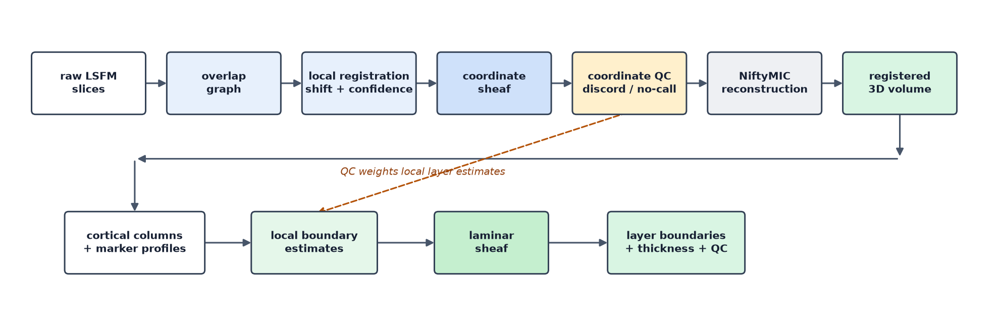


## What the current evidence says (Overview):
The coordinate/SVR proxy shows a material
change: NiftyMIC-only NCC is 0.633 and NiftyMIC supplied with sheaf-corrected
coordinates is 0.810 (a +0.177 change). The 0.914 result uses *known* corrected
coordinates and is an oracle-style ceiling, not a claimed sheaf result. For
cortical layers, the current BigBrain proxy improvement over ordinary graph
smoothing is small (MAE 0.08146 → 0.07961; Dice 0.59775 → 0.60068 at matched
80% coverage), and the local predictor still has higher Dice (0.60431). So the
honest answer is: **the method currently helps the controlled SVR stage a lot,
but we need actual LSFM data to show a large cortical-layer segmentation improvement.**

### 1. Public human light-sheet signal: registration before and after

This test starts with a public DANDI:000108 human light-sheet block [5]. The
same image is made into repeated observations with known shifts, noise, local
occlusion, and one signal-absent observation. The reference is at left. The
pairwise chain visibly drifts; the sheaf-consistent atlas rejects the bad view
and restores a coherent image.

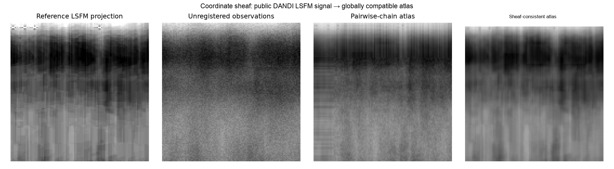

At matched 80% reporting coverage, coordinate RMSE falls from **22.73 px** for
the pairwise chain to **1.07 px** for the coordinate sheaf. This uses known,
injected shifts, so it tests the mechanism cleanly; it is not a landmarked
real-acquisition accuracy result.

### 2. Controlled NiftyMIC reconstruction comparison

This matched controlled DANDI test compares NiftyMIC reconstruction from
uncorrected inputs with the same reconstruction engine supplied with coordinate
GLASS corrections that remain fixed during reconstruction. The latter is the
appropriate pipeline comparison: GLASS owns coordinate recovery and QC;
NiftyMIC reconstructs the volume from those coordinates.

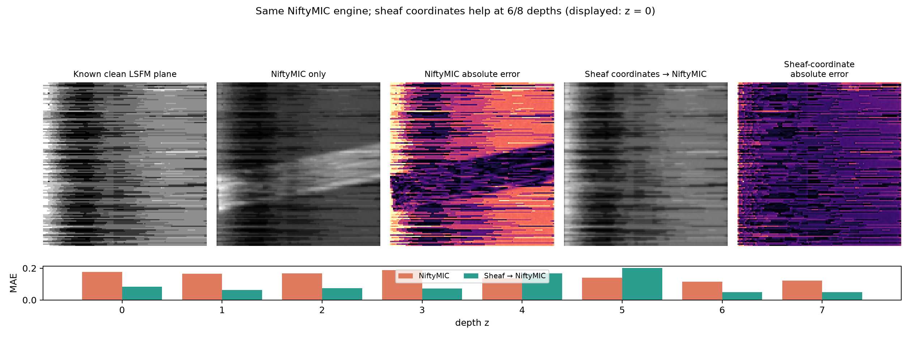

| Method | NCC | PSNR (dB) | Mean slice SSIM |
| --- | ---: | ---: | ---: |
| NiftyMIC only | 0.811 | 18.10 | 0.647 |
| Coordinate GLASS → NiftyMIC | **0.912** | **20.83** | **0.803** |

On this controlled proxy, preserving the sheaf coordinates improves every
reconstruction metric. Letting NiftyMIC re-register after GLASS instead reduces
NCC/PSNR to 0.685/15.24 dB, so it is not the intended combined pipeline. These
are not real-LSFM benchmark results: they use three synthetically shifted/noisy
repeats of eight public LSFM planes, including one signal-absent observation.

### 3. Real public overlap graph: global coordinate recovery and fault QC

The BigStitcher dataset provides real pairwise overlap transforms and an
independently published global stitching transform [2]. The left panel below
compares a pairwise-only tree, a quadratic sheaf solve, and a robust sheaf solve
against that published global field. The right panel shows node discord.

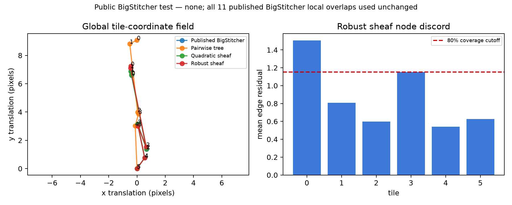

To test error handling rather than merely average-case registration, one
impossible shift of $[12,-10,+8]$ pixels is added to the published overlap from
tile 5 to tile 3. The robust sheaf keeps the atlas close to the published field
and gives high discord to the affected part of the graph.

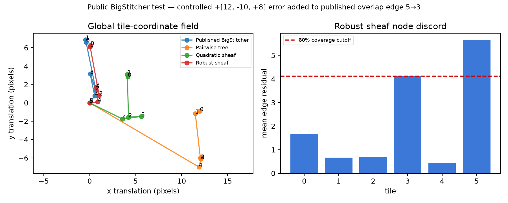

### 4. Exploratory local-deformation sheaf

This is a deliberately controlled test of the proposed extension beyond one
translation per image. A public BigStitcher microscopy projection is made into
three locally warped, noisy observations. Patch phase correlation estimates a
local displacement at 49 overlap locations per image pair. Each image then
carries a 7 × 7 displacement-control field; the restriction maps sample each
field in the physical overlap patch before comparing it with its neighbour.

The global-translation baseline compresses the same local measurements to one
shift per image. On this test, control-field MAE is **0.704 px** for the
translation baseline and **0.183 px** for the deformation sheaf. Fusing the
corrected observations gives MAE **0.0231 → 0.0135** and SSIM **0.821 →
0.939**.

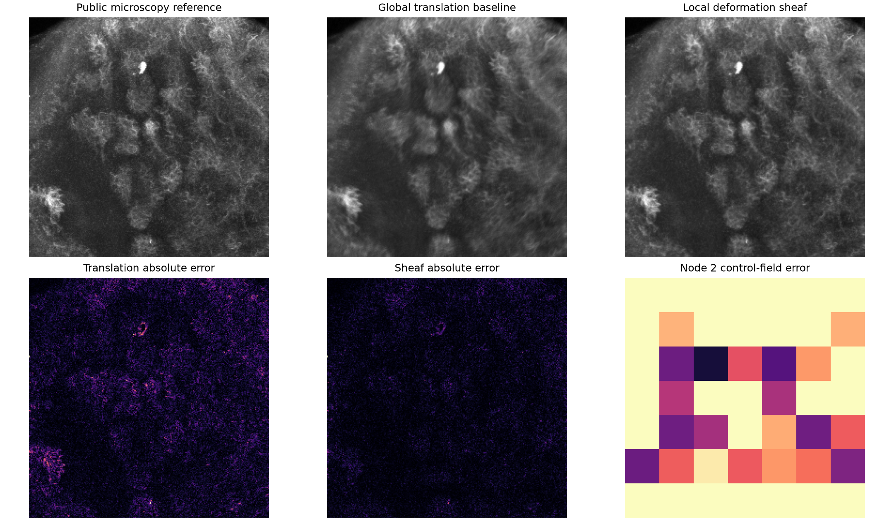

For a separate local-fault check, eight overlap-patch measurements were
corrupted. At a fixed top-10% residual no-call rate, the residual map recovered
**87.5%** of those corrupted patches; its no-call precision was **46.7%** versus
a 5.4% corrupted-patch prevalence. This is mechanism evidence only: the local
warps are synthetic, the public source is microscopy rather than LSFM, and this
is not yet a comparison with a conventional nonrigid-registration method.

### 5. Compact numerical view of the coordinate improvements

The following figure puts the three coordinate/reconstruction comparisons on
their own appropriate scales. The two RMSE panels are lower-is-better; the NCC
panel is higher-is-better. These should not be combined into one score.

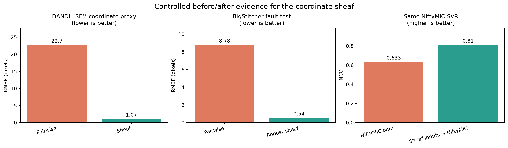

## Next steps: cortical layers and staining

Unfortunately, there aren't any cortical layer LSFM datasets to **accurately** test
this method to see if it can not only segment properly, but also if we can group
alike layers in the SVR itself to further enhance accuracy, since that is the whole
point of sheat.

Here is an example of me trying out the segmentation part on BigBrain dataset. The figure shows five true
cortical boundaries (black), local estimates (orange), ordinary graph smoothing
(blue), and the affine sheaf estimate (green) for a held-out section.

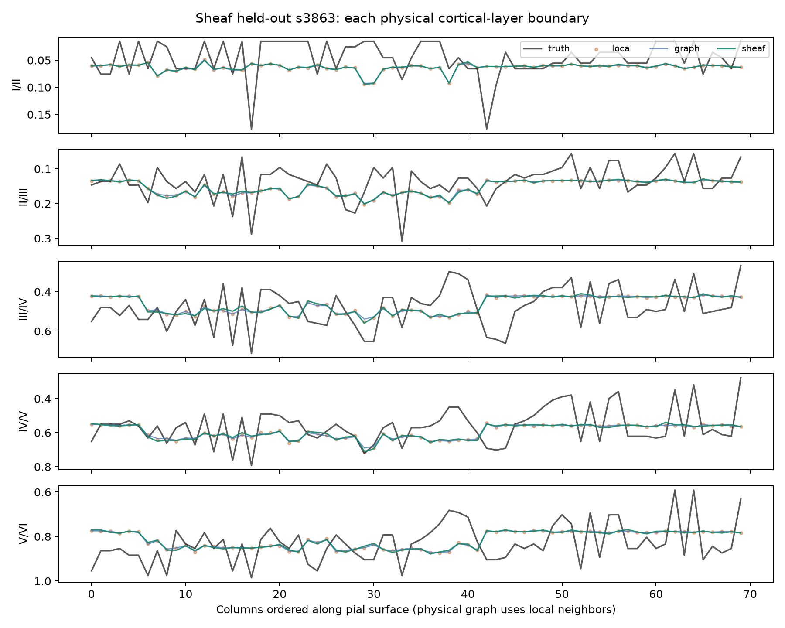

At matched 80% reporting coverage, the sheaf is better than ordinary graph
smoothing on boundary MAE (**0.07961 vs 0.08146** normalized depth) and Dice
(**0.60068 vs 0.59775**), but it does **not** beat the local predictor on Dice
(**0.60431**). This is most likely because BigBrain dataset is for a different purpose.
The bar charts deliberately show this limitation.

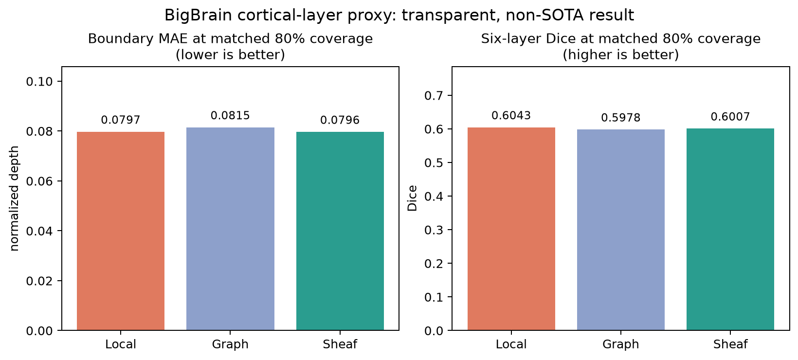


### Why staining makes this a reasonable extension

Currently, models/papers like CLARITY [8]; CUBIC [9];
and SHORT  [10];  show results motivate collecting
more than one marker, but they do not prove that the markers will segment
cortical layers equally well.

That is precisely where the sheaf is useful. Each stain or local image model
provides its own boundary proposal and uncertainty. Agreement across stains and
across neighbouring columns increases confidence. Disagreement increases the
local covariance $\Sigma_i$ or decreases the edge confidence $W_e$; if the
image evidence is too weak, the output is a no-call rather than an invented
boundary. In other words, staining becomes multiple uncertain local witnesses,
not an assumption that one intensity threshold works everywhere.

### The layer-specific formulation I propose to test

At cortical column $i$, the local measurement is a five-boundary vector:

```math
s_i=(b_{I/II},b_{II/III},b_{III/IV},b_{IV/V},b_{V/VI})\in\mathbb{R}^5.
```

Two cortical profiles may be locally stretched relative to each other, so
generic graph smoothing, which assumes equal neighbouring values, is not
physically appropriate. An image-derived profile correspondence $\phi_{ij}$
is linearized into a restriction $R_{i,e}$ and offset $d_e$ in the shared edge
coordinate system. The global boundary field is:

```math
\hat s=\underset{s}{\mathrm{argmin}}
\sum_i(s_i-m_i)^\top\Sigma_i^{-1}(s_i-m_i)+
\lambda\sum_{e=(i,j)}
\lVert R_{i,e}s_i-R_{j,e}s_j-d_e\rVert_{W_e}^2.
```

This is the same local-to-global idea as the coordinate problem. 


```bash
python -m venv .venv
.venv/bin/pip install -r requirements.txt
.venv/bin/python -m unittest discover -s code/tests -p 'test_sheaf_solver.py' -v

# Download the public six-tile BigStitcher example, then build the raw-data graph figures.
bash code/download_bigstitcher_data.sh
MPLBACKEND=Agg .venv/bin/python code/make_figures.py

# Real-overlap graph and fault-QC visualizations.
MPLBACKEND=Agg .venv/bin/python code/bigstitcher_validation.py
MPLBACKEND=Agg .venv/bin/python code/bigstitcher_validation.py --inject-fault

# Controlled local-deformation reconstruction test on a public tile.
MPLBACKEND=Agg .venv/bin/python code/deformation_sheaf_validation.py

# Held-section cortical-layer proxy.
MPLBACKEND=Agg .venv/bin/python code/cortical_layer_proxy.py
```

The DANDI coordinate and NiftyMIC tests use public DANDI signal. The NiftyMIC
evaluation additionally requires Docker and completed NiftyMIC reconstructions;
see `code/niftymic_comparison.py`.

## References and data sources

1. J. Hansen and R. Ghrist, [“Toward a spectral theory of cellular sheaves,”
   *Journal of Applied and Computational Topology*, 3, 315–358 (2019)](https://doi.org/10.1007/s41468-019-00038-7).
2. D. Hörl *et al.*, [“BigStitcher: reconstructing high-resolution image
   datasets of cleared and expanded samples,” *Nature Methods*, 16, 870–874
   (2019)](https://doi.org/10.1038/s41592-019-0501-0).
3. M. Ebner *et al.*, [“An automated framework for localization, segmentation
   and super-resolution reconstruction of fetal brain MRI,” *NeuroImage*, 206,
   116324 (2020)](https://doi.org/10.1016/j.neuroimage.2019.116324).
4. K. Amunts *et al.*, [“BigBrain: an ultrahigh-resolution 3D human brain
   model,” *Science*, 340, 1472–1475 (2013)](https://doi.org/10.1126/science.1235381).
5. Public human light-sheet data: [DANDI:000108](https://github.com/dandisets/000108).
6. K. Wagstyl *et al.*, [“BigBrain 3D atlas of cortical layers: Cortical and
   laminar thickness gradients diverge in sensory and motor cortices,” *PLOS
   Biology*, 18, e3000678 (2020)](https://doi.org/10.1371/journal.pbio.3000678).
7. K. Wagstyl *et al.*, [“Mapping Cortical Laminar Structure in the 3D
   BigBrain,” *Cerebral Cortex*, 28, 2551–2562
   (2018)](https://doi.org/10.1093/cercor/bhy074).
8. K. Chung *et al.*, [“Structural and molecular interrogation of intact
   biological systems,” *Nature*, 497, 332–337
   (2013)](https://doi.org/10.1038/nature12107).
9. E. A. Susaki *et al.*, [“Whole-brain imaging with single-cell resolution
   using chemical cocktails and computational analysis,” *Cell*, 157,
   726–739 (2014)](https://doi.org/10.1016/j.cell.2014.03.042).
10. L. Pesce *et al.*, [“3D molecular phenotyping of cleared human brain
    tissues with light-sheet fluorescence microscopy,” *Communications
    Biology*, 5, 447 (2022)](https://doi.org/10.1038/s42003-022-03390-0).
11. A. Santhirasekaram, K. Pinto, M. Winkler, A. Rockall, and B. Glocker,
    [“A Sheaf Theoretic Perspective for Robust Prostate Segmentation,”
    *MICCAI*, 249–259 (2023)](https://doi.org/10.1007/978-3-031-43901-8_24).
